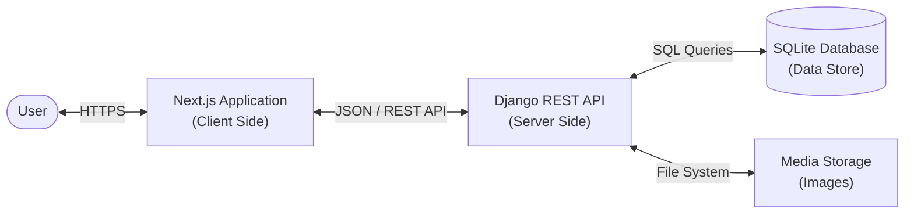

# 🍳 Food Recipe Project

A modern, full-stack web application for exploring, creating, and managing food recipes. Built with a production-ready **Django** backend and a dynamic **Next.js 14** frontend, this project demonstrates a seamless integration of robust APIs with a responsive, dark-mode-first user interface.


---

## 🏗️ Architecture Design

The system employs a decoupled **Client-Server Architecture**, ensuring scalability and separation of concerns.

-   **Backend (API Layer)**: Powered by **Django REST Framework (DRF)**. It acts as the centralized data authority, handling authentication (future-proofed), database interactions, and media storage.
-   **Frontend (Presentation Layer)**: A high-performance **Next.js** application. It serves as a rich Single Page Application (SPA), consuming REST APIs to provide an interactive user experience with partial page updates and modal interfaces.



---

## 🛠️ Technology Stack

### Backend Core
| Component | Technology | Description |
| :--- | :--- | :--- |
| **Framework** | **Django 6.0.1** | High-level Python web framework. |
| **API** | **Django REST Framework** | Toolkit for building Web APIs. |
| **Database** | **SQLite** | Lightweight relational database. |
| **Image Proc**| **Pillow** | Library for handling recipe image uploads. |
| **Language** | **Python 3.14** | Latest supported Python runtime. |

### Frontend Core
| Component | Technology | Description |
| :--- | :--- | :--- |
| **Framework** | **Next.js 14 (App Router)** | React framework for production. |
| **UI Library** | **React 18** | library for building user interfaces. |
| **Styling** | **Tailwind CSS** | Utility-first CSS framework for rapid UI. |
| **Language** | **TypeScript** | Statically typed JavaScript. |

---

## 📚 API Reference

The backend provides a RESTful interface accessible at `http://127.0.0.1:8000/api/recipes/`.

| Method | Endpoint | Description |
| :--- | :--- | :--- |
| `GET` | **`/api/recipes/`** | **List All**: Retrieve all recipes. |
| `GET` | **`/api/recipes/?search=query`** | **Search**: Filter recipes by name. |
| `POST` | **`/api/recipes/`** | **Create**: Upload a new recipe (multipart/form-data). |
| `GET` | **`/api/recipes/{id}/`** | **Retrieve**: Get full details of a single recipe. |
| `PUT` | **`/api/recipes/{id}/`** | **Update**: Modify details (Supports partial updates). |
| `DELETE` | **`/api/recipes/{id}/`** | **Delete**: Remove a recipe permanently. |

---

## 🚀 Getting Started

Follow these steps to set up the project locally.

### Prerequisites
-   **Python 3.10+**
-   **Node.js 18+** & **npm**

### 1. Backend Setup (Django)
```bash
# Navigate to backend
cd backend

# Install Python dependencies
pip install django djangorestframework django-cors-headers Pillow

# Setup Database
python manage.py migrate

# Seed Data (Optional - imports sample recipes)
# python manage.py shell < foodrecipe/seed.py

# Start Server
python manage.py runserver
```
*Server runs at: `http://127.0.0.1:8000`*

### 2. Frontend Setup (Next.js)
```bash
# Navigate to frontend (in a new terminal)
cd frontend

# Install Node modules
npm install

# Start Development Server
npm run dev
```
*App runs at: `http://localhost:3000`*

---

## 🎨 Key Features

### 🌙 Immersive Dark Mode
A carefully crafted dark theme providing a visual comfortable experience, accented with modern gradients and shadows.

### ⚡ Instant Search
Real-time filtering capabilities allow users to find their favorite recipes instantly without page reloads.

### 🔄 Full CRUD Operations
-   **Create**: Upload high-quality food images with descriptions.
-   **Read**: View details in a non-intrusive, beautiful modal.
-   **Update**: Edit typos or change images with a live preview.
-   **Delete**: Secure deletion with user confirmation.

### 📱 Responsive Design
Fully responsive layout that adapts gracefully from large desktop monitors to mobile devices using Tailwind's responsive modifiers.

---


